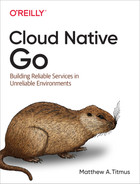

# Hexarc

This project is an adaptation of the [**hexarc**](https://github.com/cloud-native-go/examples/tree/main/ch08/hexarch) project presented in chapter 8 of the book [*'Cloud Native Go - Building Reliable Services in Unreliable Environments*'](https://learning.oreilly.com/library/view/cloud-native-go/9781492076322/) by [**Matthew A. Titmus**](https://www.oreilly.com/pub/au/8008).

Basic architecture: *frontend* → *core* → *backend*

**frontend:** receives requests from clients (gRPC, REST, web) and access *core* functionality;

**core:** implements a key/value store service;

**backend:** logs operations executed by *core* and rebuilds the state of the key/value store;

This repository is still a work in progress.
